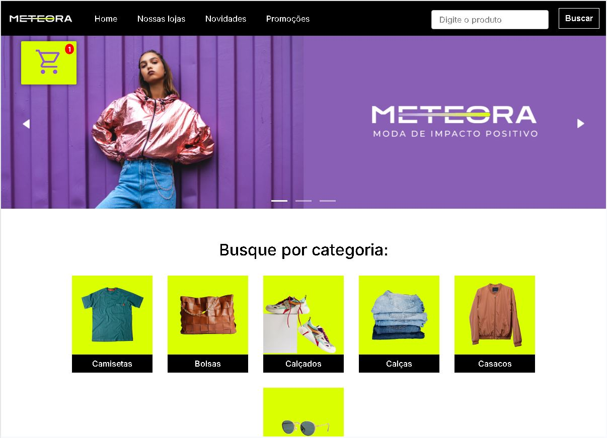
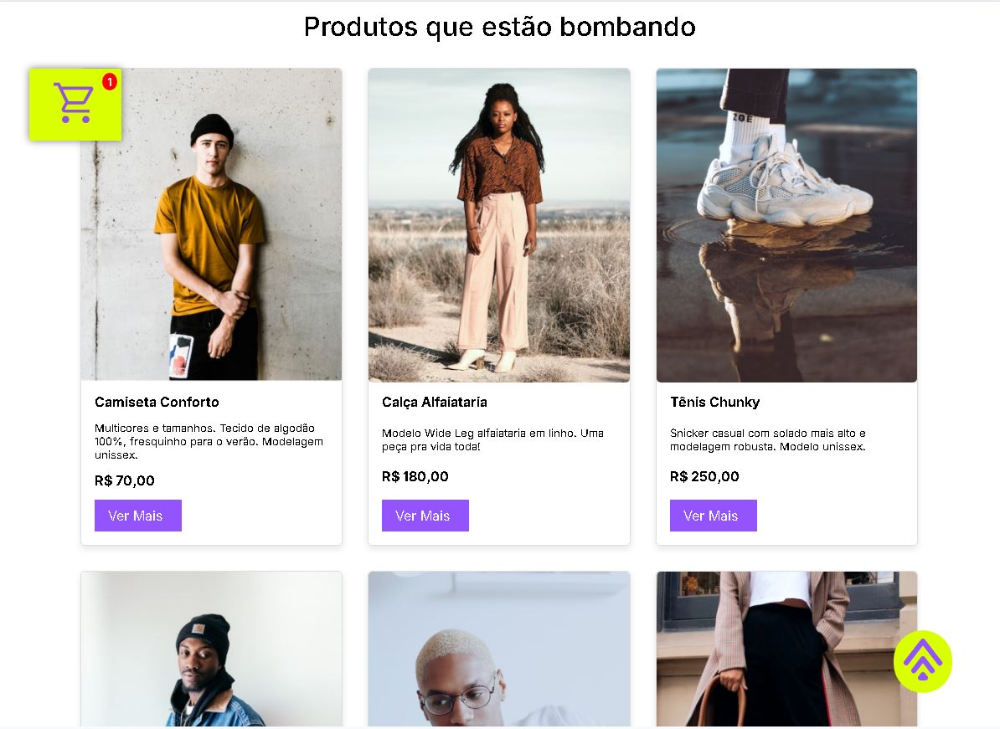
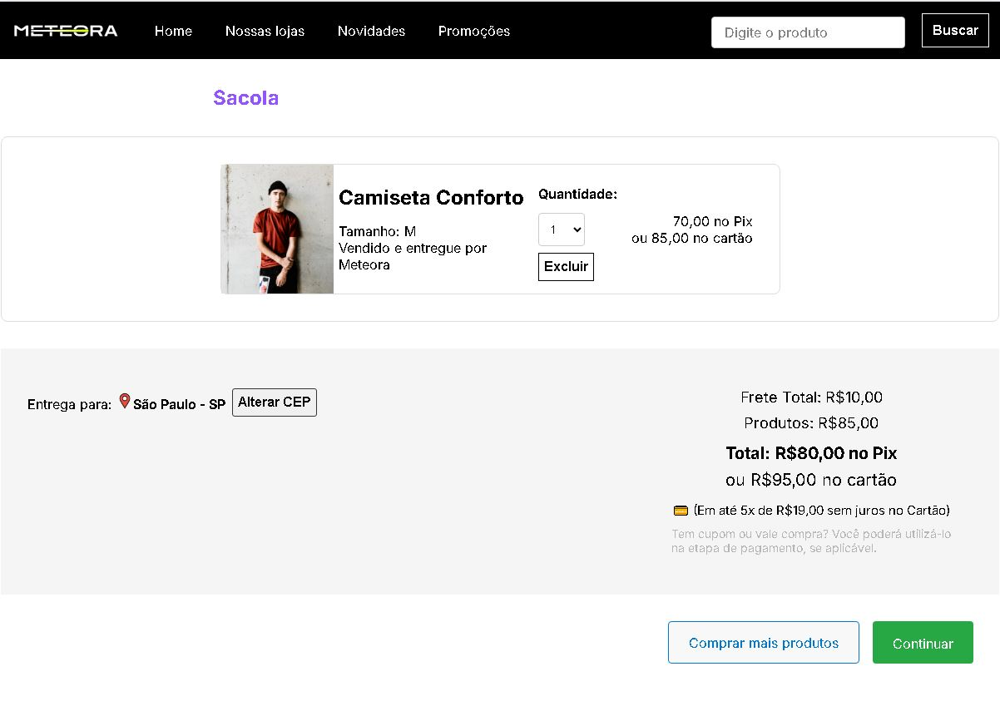

# 🛍️ Projeto Meteora

> **Meu primeiro grande projeto completo**: um e-commerce responsivo e interativo, desenvolvido com **HTML**, **CSS** e **JavaScript**.

---

## 🎯 Sobre o projeto

O **Meteora** é um e-commerce fictício que simula uma loja online, com foco em usabilidade, responsividade e boas práticas de desenvolvimento front-end.

Este projeto foi criado com o objetivo de colocar em prática habilidades como:

✅ Estruturação semântica com HTML5  
✅ Estilização moderna com CSS3  
✅ Layouts responsivos com media queries  
✅ Manipulação do DOM com JavaScript  
✅ Armazenamento de dados com localStorage  
✅ UX e UI pensadas para uma boa experiência  

---

## 🖥️ Tecnologias utilizadas

- HTML5  
- CSS3  
- JavaScript (ES6)  

---

## 🚀 Funcionalidades

✅ Carrossel de imagens na home  
✅ Modal de exibição de produtos com escolha de cores e tamanhos  
✅ Carrinho de compras dinâmico  
✅ Cálculo de frete via localStorage  
✅ Formas de pagamento: PIX, Cartão e Boleto  
✅ Layout 100% responsivo para desktop, tablet e mobile  
✅ Publicado no **GitHub Pages**  

---

## 🌐 Acesse o projeto online:

> 🔗 [https://daissamatias.github.io/Site-Meteora/](https://daissamatias.github.io/Site-Meteora/)  

---

## 🛠️ Como rodar o projeto localmente

1. Clone o repositório:

```bash
git clone https://github.com/seu-usuario/meteora.git
```

2. Acesse a pasta do projeto:  
```bash
cd meteora
```

3. Abra o arquivo `index.html` no seu navegador preferido.  

---

## 📸 Screenshots
 
> Exemplo:
> 
> 
> 
> 
>  
>   

---

## 📚 Aprendizados

Durante o desenvolvimento do Meteora, aprimorei meus conhecimentos em:

✅ Organização de arquivos e código  
✅ Responsividade avançada com CSS  
✅ Manipulação de eventos no JavaScript  
✅ Boas práticas de versionamento com Git e GitHub  
✅ Deploy de projetos estáticos no GitHub Pages  

---

## 🙋‍♀️ Desenvolvedora

**Daissa**  

[](https://www.linkedin.com/in/daissa-matias-figueredo/)  
[](https://github.com/DaissaMatias)  

---

## 🤝 Contribuições

Contribuições, feedbacks ou sugestões são sempre bem-vindos!  
Sinta-se à vontade para abrir uma **issue** ou enviar um **pull request**.

---

## 📄 Licença

Este projeto está sob a licença **MIT**.  
Sinta-se livre para usar e modificar.

---
